# huiyuan_private_assets

🚂

## 1.1 checkbox测试

* [ ]
* [x]
* [ ]

## 1.2 脚注测试

| 12111111111111111 | title | title |
| ----------------- | ----- | ----- |
| conte             | conte | conte |

自从[^1]你生下来的那一刹那起，你就注定要回去。这中间的曲折磨难、顺畅欢乐便是你的命运。

命运总是与你一同存在，时时刻刻。不要敬畏它的神秘，虽然有时它深不可测；不要惧怕它的无常，虽然有时它来去无踪。

不要因为命运的怪诞而俯首听命于它，任凭它的摆布。等你年老的时候，回首往事，就会发觉，命运有一半在你手里，只有另一半才在上帝的手里。你一生的全部就在于：运用你手里所拥有的去获取上帝所[^2]掌握的。

你的努力越超常，你手里掌握的那一半就越庞大，你获得的就越丰硕。在你彻底绝望的时候，别忘了自己拥有一半的命运；在你得意忘形的时候，别忘了上帝手里还有一半的命运。

你一生的努力就是：用你自己的一半去获取上帝手中的一半。这就是[^3]命运的一生；这就是一生的命运。

（摘自《涉世之初》创刊号）

## 1.3 流程图测试

::: mermaid
graph TD; 
A-->B; 
A-->C; 
B-->D; 
C-->D; 
:::

```mermaid
architecture-beta
    service user(mdi:account)
    service lambda(logos:aws-lambda)

    user:R --> L:lambda
```



```JS
function add() {
    console.log(1212)
}
```

[^1]: 自己

[^2]: 拥有

[^3]: 已经注定的
